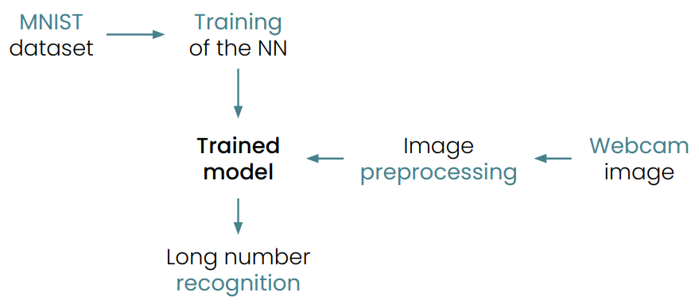
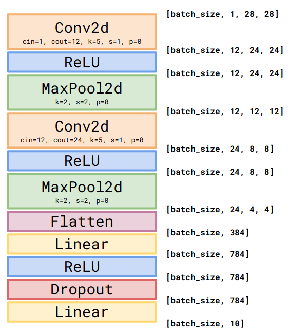
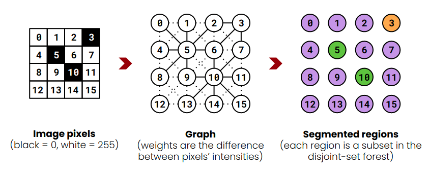
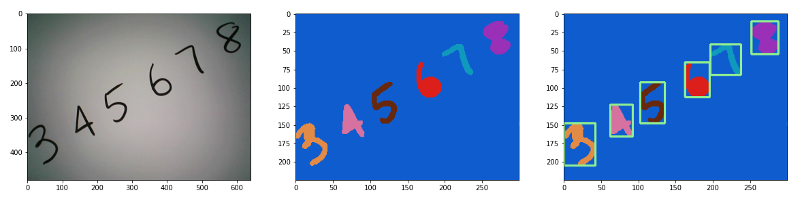
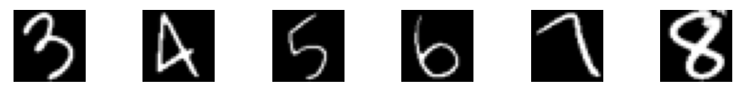
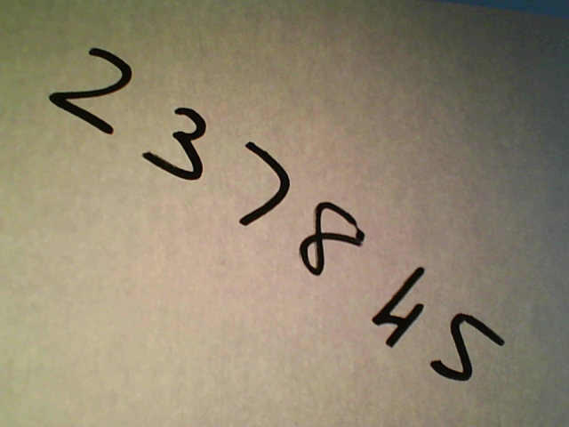
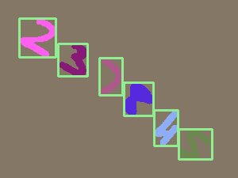

# Handwritten (long) numbers recognition
> Build a Neural Network capable of recognize long handwritten numbers via the use of a webcam.

---
The aim of this project is to build a CNN model trained on MNIST dataset and to exploit its classification capabilities to recognize a sequence of several single handwritten digits (that can be considered as a long number) given as an input image that the user can take from her/his webcam.

> **STRONG ASSUMPTION**: the input image must have homogeneous white background, and the digits must be written in dark color (or at least there must be a good constrast between the background and the foreground).

---
**Table of contents**

* [Project description](#project-description)
* [Download and setup](#download-and-setup)
* [Usage example](#usage-example)
* [Future developments](#future-developments)
* [Directory structure](#directory-structure)
* [Documentation](#documentation)
* [Info](#info)

---

## Project description

**Workflow**

  <p align="center">
  
  </p>

As the picture shows, the project may be divided into three main phases:

 * [**Phase 1**: Training of the model](#phase-1-training-of-the-model)
 * [**Phase 2**: Input image segmentation and digit extraction](#phase-2-input-image-segmentation-and-digit-extraction)
 * [**Phase 3**: Long number recognition](#phase-3-long-number-recognition)
 
In a nutshell: the CNN model is trained on the MNIST dataset (with data augmentation techniques and without them) in order to obtain a trained model. Once the trained model is ready, it can be fed with the input image (taken from the webcam) which has been preprocessed and segmented accordingly. At this point the model can classify all the single digits written on the input image and returns the whole long number.


### Phase 1: Training of the model

This phase takes care of several tasks:
* [MNIST dataset decoding and management](#mnist-dataset-decoding-and-management)
* [CNN model implementation](#cnn-model-implementation)
* [Training of the model](#training-of-the-model)


#### MNIST dataset decoding and management  

(_a detailed explanation is given [here][file-decode-notebook]_)  

The MNIST dataset comes from the original [source][mnist] in the `.IDX` format which has a particular encoding (well explained in the official website and in the notebook).  
Its decoding and management is handled by the [`modules.dataset`][modules-dataset] module and, in particular by the `modules.dataset.MNIST()` class, built as follows:
 * `__init__()`: class constructor
    * downloads the training dataset (`train==True`) or the test dataset (`train==False`) if specified (`download_dataset==True`) and if it is not already downloaded by exploiting the `modules.dataset.download()` function
    * leaves the dataset empty if specified (`empty==True`) or stores the data and the labels in the corresponding `torch.tensor` by exploiting the `modules.dataset.store_to_tensor()` function
 * `set_preprocess()`: sets a custom preprocess operation to be applied to each data sample
 * `splits()`: splits the dataset according to the provided proportions and returns training and validation sets  
    * if `shuffle==True` the dataset is randomly shuffled before being split
 * `get_loader()`: returns the `torch.utils.data.DataLoader` for the current dataset
    * provides an iterable over the dataset 
    * iterates over a number of samples given by `batch_size`
    * exploits a number of workers (`num_workers`) to load the samples
    * if `shuffle==True`, data is randomly shuffled at every iteration
 * `classes_distribution()`: returns the distribution of the classes of the current dataset
 * `statistics()`: prints some statistics of the current dataset


#### CNN model implementation  

For the purpose of this project, the network used for the digit recognition task is a Convolutional Neural Network (CNN). The architecture of the model is the one shown below.

  <p align="center">
  
  </p>  

The input image (which has a shape of 1x28x28) is fed into the first convolutional layer (having 12 output channels, 5x5 kernel and stride equal to 1), it is then passed through a ReLU function and a max pooling layer (having a 2x2 kernel and a stride equal to 2). This procedure is repeated (the only difference is the number of output channel of the new convolutional layer, which are 24), thus obtaining a 24x4x4 image. A flatten layer is applied, then a linear layer and another ReLu. In order to make the training phase more robust, the dropout technique is used, and another linear layer is applied at the end letting us obtain 10 output neurons of which we take the one having maximum value (softmax is applied).
  
This entire procedure is handled by the [`modules.cnn`][modules-cnn] module and, in particular, by the `modules.cnn.CNN()` class, built as follows:
* `__init__()`: class constructor
  * builds the CNN model (the one shown in the figure above)
  * moves the model to the selected device (`cpu`, `cuda:0`, ...)
  * defines the preprocess operation (`data_augmentation==True`) to be performed on the samples of the dataset while iterating over it or leaves the image  
> **NOTE 1**: in this project the data augmentation technique consists of a random rotation (between -30° and +30°), followed by a crop of random scale (between 0.9 and 1.1) and of random ratio (between 3/4 and 4/3) of the original size which is then resized to the original 28x28 size.  
> **NOTE 2**: higher degrees of rotation may lead to unwanted behaviours (MNIST is not rotation-invariant: 6 -> 9)  
 * `save()` and `load()`: saves and loads, respectively, the classifier's `state_dict` which maps each layer (having learnable parameters) to its parameters tensor
 * `forward()`: computes the output of the network (implicitly builds the computational graph)
   * computes the non-normalized output (logits) of the network
   * applies the `softmax` function to the logits, obtaining the normalized (between 0 and 1) output
 * `__decision()`: chooses the output neuron having maximum value among all the others (applies `argmax`)
 * `__loss()` function: applies the `torch.nn.functional.cross_entropy` loss to the output (before `softmax`)
   * a `weights` tensor is also provided to the function in order to weight the slight unbalance between classes
 * `__performance()`: computes the accuracy (correct decisions over all made decisions)
 * `train_cnn()`: training procedure
   * exploits the `get_loader()` function to get the `DataLoader`s of training and validation set with the provided `batch_size`
   * iterates over the `epochs` and applies the `forward()` procedure to each mini-batch
   * computes the loss and backpropagates it using the `backward()` method, which stores the gradients for each model parameter (after zeroed them with `zero_grad()`)
   * uses Adam optimizer's `step()` method to update all the (learnable) parameters
   * evaluates the performances on the current mini-batch (by first switching off the `autograd` engine) and accumulates the accuracies and the losses
   * save the best model found so far
 * `eval_cnn()`: evaluates the accuracy over the provided `dataset` by forwarding it (batch by batch) through the model and accumulating the accuracies on each mini-batch
 * `classify()`: forwards an input sample (or batch of samples) through the model and makes a decision
 * `__plot()`: plots the validation and training accuracies over the epochs (used by `train_cnn()` method)
     
     
#### Training of the model  

The training procedure is performed both with data augmentation and without it, by the `modules.utils.train()` function inside the [`modules.utils`][modules-utils] module.
  
> **NOTE 1**: in this project the data augmentation technique consists of a random rotation (between -30° and +30°), followed by a crop of random scale (between 0.9 and 1.1) and of random ratio (between 3/4 and 4/3) of the original size which is then resized to the original 28x28 size.

> **NOTE 2**: higher degrees of rotation may lead to unwanted behaviours (MNIST is not rotation-invariant: 6 -> 9)
  
(_more details about the usage of the script are provided in [usage example](#usage-example)_)
 
The script works as follows:
* initializes the `CNN` classifier
* prepares the `MNIST` dataset into training, validation and test sets
* trains the classifier by means of the `train_cnn()` function of the `CNN()` class
  
For the training phase, several parameters can be choosen such as:
* the splits proportions
* the learning rate
* the number of epochs
* the mini-batch size
* the number of workers
* the device used


### Phase 2: Input image segmentation and digit extraction

This phase takes care of several tasks:
* [Webcam image capture](#webcam-capture)
* [Image segmentation](#image-segmentation)
* [Digits extraction](#digits-extraction)


#### Webcam capture

This task is performed by the `modules.utils.webcam_capture()` function inside [`modules.utils`][modules-utils] module.
It exploits the **OpenCV** library in the following way:
* opens the webcam (`cv2.VideoCapture(0)`)
* shows the captured frames in a while loop until:
  * `SPACE` key is pressed: take a snapshot
  * `ESC` key is pressed: close webcam and exit
* once the snapshot is taken, it is directly send to the CNN model in order to be classified
  
  
#### Image segmentation

(_a detailed explanation is given [here][graph-based-segmentation]_)

In this project, the image segmentation task, is computed by exploiting the **Graph-based image segmentation algortihm** proposed by Felzenszwalb et. al. ([paper][graph-based-segmentation-paper]). In the aforementioned paper and notebook, more details are provided about the algorithm functioning.

<p align="center">

</p>

This procedure is handled by the [`modules.segmentation`][modules-segmentation] module and, in particular by the `module.segmentation.GraphBasedSegmentation()` class, built as follows:
* `__init__()`: class contructor
  * takes an input image (`PIL.Image` or `numpy.ndarray`)
  * sets `width` and `height`
* `__preprocessing()`: applies preprocessing operations to the input image
  * converts it to grayscale
  * applies a [gaussian blur filter](https://pillow.readthedocs.io/en/stable/reference/ImageFilter.html#PIL.ImageFilter.GaussianBlur) (default radius is 2.3)
  * applies a [constrast enhancement](https://pillow.readthedocs.io/en/3.0.x/reference/ImageEnhance.html#PIL.ImageEnhance.Contrast) (default factor is 1.5)
  * resizes the image in order to speed the process up (less node in the graph)
* `__get_diff()`: returns the difference (in terms of intensity) between two pixels of an image
* `__create_edge()`: creates the graph edge between two pixels of the image (the associated weight is given by `__get_diff()`)
* `__threshold()`: defines the threshold for a subset of a given cardinality, which will be used in `segment()` to decide whether to merge two subsets
* `__build_graph()`: builds the graph connecting the pixels (`__create_edge()`) according to their eight neighbors
* `__sort()`: sorts the edges of the graphs (a.k.a. connection between pixels of the image) according to the connection weights, in non-decreasing order which is what is required by the algorithm
* `segment()`: segment the graph based on the algorithm using some tuning parameters (`k` and `min_size`)
  * applies the preprocessing operations (if `preprocessing==True`) to the image
  * initializes the disjoint-set forest data structure (see below, `DisjointSetForest()` class)
  * builds the graph (`__build_graph()`) and sorts it (`__sort()`)
  * applies the algorithm by iterating over all the sorted weights and merging the correspondent nodes if they belongs to different components and if the _difference between components_ is greater than the _minimum internal difference_ (`__threshold()` is used here, along with the tuning parameter `k`)
  * remove components having size less than `min_size` by merging them with one of the neighbor components
* `__create_segmented_arr()`: creates the array having same shape `(height,width)` in which each element represents the component the corresponding pixel belogs to
* `generate_image()`: generates the segmented image by giving random colors to the pixels of the various regions (a.k.a. components)
* `__find_boundaries()`: finds the boundaries of the segmented regions by looping over the image array and setting the `min_col`, `min_row`, `max_col` and `max_row` for each region
* `draw_boxes()`: draws the boxes around the segmented regions exploiting the found boundaries
* `extract_digits()`: extract a `torch.tensor` of the segmented digits (see next step)

The `GraphBasedSegmentation()` class is based on the `modules.segmentation.DisjointSetForest()` class, which represents the data-structure used by the algorithm (this class is only used within the `GraphBasedSegmentation()` class).

<p align="center">

</p>

#### Digits extraction 

(_a detailed explanation is given [here][digits-extraction]_)  

The digit extraction procedure is carried out by the `extract_digits()` method of the `GraphBasedSegmentation()` class.  
Once the regions' boundaries are found:
* the regions are sliced out from the original image
* the slices are resized according to the MNIST dataset samples dimensions (28x28)
* the resized slices are modified in order to obtain an image which is as close as possible to the one that the network saw in training phase
* the modified slices are converted into a `torch.tensor` which will be used as input to the network
<p align="center">

</p>


### Phase 3: Long number recognition

This phase, is simpler than the others, and can be split into three steps:
* [Input of the network: extracted digits](#input-of-the-network-extracted-digits)
* [Output of the network: long number](#output-of-the-network-long-number)
* [Results](#results)


#### Input of the network: extracted digits

This task is mainly handled by the `modules.utils.classify()` function inside the [`modules.utils`][modules-utils] module.
It works as follows:
* starts the webcam image capture procedure (if `webcam==True`) or takes an input image from a folder defined by the user (if `image_path is not None`)
* initializes the `CNN` classifier
* loads the pre-trained model **with** data augmentation (if `augmentation==True`) or the one **without** data augmentation (if `augmentation==False`)
* segments the image via the `segment()` method of the `GraphBasedSegmentation()` class
* extracts the digits via the `extract_digits()` method of the `GraphBasedSegmentation()` class


#### Output of the network: long number

As for the previous step, this task is handled by the `modules.utils.classify()` function.

After the digits have been extracted, they are shown as a batch to the network.  
The last step is the following:
* classify each single digit exploiting the `classify()` method of the `CNN()` class

The result of this procedure is a `torch.tensor` which stores the recognize number
```
The recognize number is: 345678
```


#### Results

For the training procedure, several models have been tried. In the following table the accuracies for each model are reported:

| model                   | test acc. | validation acc. | training acc. |
|-------------------------|-----------|-----------------|---------------|
| CNN-128b-60e-0.001l-a   |   99.03   |      99.11      |     99.05     |
| CNN-128b-60e-0.001l     |   98.80   |      98.82      |     99.94     |
| CNN-128b-60e-0.0001l-a  |   99.49   |      99.23      |     99.29     |
| CNN-128b-60e-0.0001l    |   99.18   |      98.99      |     100.00    |
| CNN-128b-60e-0.00001l-a |    98.6   |      98.56      |     97.80     |
| CNN-128b-60e-0.00001l   |   98.57   |      98.36      |     99.63     |

As we can see, the models trained with data augmentation techniques show a better behaviour on the test set compared to the ones trained without data augmentation. The latters fit the training set in a better way and that is reasonable since the training phase is less hard with respect to the training phase with augmentation. The choice of the learning rate seems to be in favour of 0.0001, although the model with learning rate of 0.00001 may have performed better if the number of epochs had been greater.


During the recognition task (performed using the `CNN-128b-60e-0.0001l-a` model), the numbers are generally well classified even if they are presented in diagonal (the random rotation, applied during the training phase, seems to allow us to handle rotated digits), as shown in the figure below.

<p align="center">



</p>
<p align="center">

</p>

```
The recognize number is: 237845
```

However, the network seems to have some problems recognizing digits such as 1, 7 and 9. In particular (as shown below) 

So, using the `CNN-128b-60e-0.0001l-a` model, the task of recognizing the handwritten digits given an input image (either from webcam or from folder) perform well when the digits are well defined with respect to the background and well separated from each other.

In the example shown below, we can see that when they are partially overlapped, the segmentation task (and in particular the phase in which the boxes are drawn around the digits) may not worked as expected. This is also the case of images in which the background is not homogeneous.


## Download and Setup

First, be sure to have installed in your system at least the following:

* `python 3.8.5`
* `pip 20.0.2`
* `git 2.25.1`

I'm not able to guarantee that other versions will work correctly.

Then, the project directory can be downloaded using the following commands in a Linux/MacOS/Windows terminal:

```
git clone https://github.com/filippoguerranti/handwritten_long_numbers_recognition.git
cd handwritten_long_number_recognition
pip3 install -r requirements.txt
```

The last command will install all the needed dependencies for this project.
Some issues may arise for the OpenCV library. If it happens, please see the note below for more informations.

> **NOTE**: informations about how to install OpenCV in your platform can be found [here][opencv-installation].


## Usage example

Once the repository has been downloaded and all the dependencies have been installed, one can procede with the paths listed here:
* [**Path 1**: use the already trained model and start the long number recognition procedure](#path-1)
* [**Path 2**: train the model in your machine in order to use this new model as a classifier](#path-2)
* [**Path 3**: evaluate the performance of a model on the test set of MNIST](#path-3)

The three path can be taken by using the `hlrn.py` script, whose behaviour is shown by typing: `$ python3 hlrn.py -h`
```
usage: hlnr.py [-h] {classify,train,eval} ...

Handwritten long number recognition

positional arguments:
  {classify,train,eval}
                        <required> program execution mode: classify with a pre-trained model
                        or re-train the model
    classify            classify an input image using the pre-trained model
    train               re-train the model in your machine and save it to reuse in classify phase
    eval                evaluate the model accuracy on the test set of MNIST

optional arguments:
  -h, --help            show this help message and exit
```

### Path 1

This path allows the recognition of the handwritten digits which come from either:
* an image captured by the user webcam
* an image stored in a user-defined folder

Additionaly, one can decide whether to:
* use a supplied pre-trained model (which can be found in `models` folder) 
* use a model trained by the user (following [path 1](#path-1))

In both cases the models are stored as `.pth` files having the following notation:
* `CNN-__b-__e-__l-a.pth` (if trained **with** data augmentation)
* `CNN-__b-__e-__l.pth` (if trained **without** data augmentation).

The underscores `__` are replaced with numbers according to:
* `b`: batch size, `e`: number of epoch, `l`: learning rate

_Example_:  
`CNN-128b-60e-0.0001l-a.pth` represents the model trained with 128 samples per batch, in 60 epochs, with a learning rate of 0.0001 and data augmentation.

The default models will be:
* `CNN-128b-60e-0.0001l-a` (if the user specifies to use the model trained **with** data augmentation)
* `CNN-128b-60e-0.0001l` (if the user specifies to use the model trained **without** data augmentation)

Alternatively, one can use its own trained model (which, by default, will be saved in the `models` folder accordingly with the previous notation).

In order to do so, the following command can be typed into a terminal to show the usage of the `classify` execution mode:
  * `$ python3 hlnr.py classify -h`
  
  ```
  usage: hlnr.py classify [-h] [-f PATH_TO_IMAGE] [-a | -m PATH_TO_MODEL] [-d DEVICE]

  CLASSIFY mode: classify an input image using a pre-trained model

  optional arguments:
    -h, --help            show this help message and exit
    -f PATH_TO_IMAGE, --folder PATH_TO_IMAGE
                          input image from folder, if not specified from webcam
    -a, --augmentation    use model trained WITH data augmentation
    -m PATH_TO_MODEL, --model PATH_TO_MODEL
                          user custom model from path
    -d DEVICE, --device DEVICE
                          (default=cpu) device to be used for computations {cpu, cuda:0, cuda:1, ...}
  ``` 
  
  * `$ python3 hlnr.py classify`: performs the recognition of the input image taken by **webcam** (default behaviour) and exploiting the pre-trained model **without** data augmentation
  
  * `$ python3 hlnr.py classify -a`: performs the recognition of the input image taken by **webcam** (default behaviour) and exploiting the pre-trained model **with** data augmentation (`-a`)
  
  * `$ python3 hlnr.py classify -m PATH_TO_MODEL`: performs the recognition of the input image taken by **webcam** (default behaviour) and exploiting the model specified by the user (`-m PATH_TO_MODEL`)
  
  * `$ python3 hlnr.py classify -f PATH_TO_IMAGE`: performs the recognition of the input image taken from the user-defined **folder** (`-f PATH_TO_IMAGE`) and exploiting the pre-trained model **without** data augmentation
  
  * `$ python3 hlnr.py classify -f PATH_TO_IMAGE -a`: performs the recognition of the input image taken from the user-defined **folder** (`-f PATH_TO_IMAGE`) and exploiting the pre-trained model **with** data augmentation (`-a`) 
  
  * `$ python3 hlnr.py classify -f PATH_TO_MODEL -m PATH_TO_MODEL`: performs the recognition of the input image taken from the user-defined **folder** (`-f`) and exploiting the model specified by the user (`-m PATH_TO_MODEL`)
  


### Path 2
TODO

---

 

To start the training procedure, one can type the following commands in a terminal (being sure to be inside the `handwritten-long-numbers-recognition` folder) which calls the `train` mode of the `hlrn.py` script:

  * `$ python3 hlnr.py train -h`: shows the help of the `train` execution mode
  * `$ python3 hlnr.py train -a`: trains the network **with** data augmentation (`-a`) (keeps the default values for the other parameters)
  * `$ python3 hlnr.py train`: trains the network **without** data augmentation (keeps the default values for the other parameters)
  ```
  usage: hlnr.py train [-h] [-a] [-s TRAIN VAL] [-b BATCH_SIZE] [-e EPOCHS] [-l LEARNING_RATE] [-w NUM_WORKERS]
                       [-d DEVICE]

  TRAIN mode: re-train the model in your machine and save it to reuse in classify phase

  optional arguments:
    -h, --help            show this help message and exit
    -a, --augmentation    set data-augmentation procedure ON (RandomRotation and RandomResizedCrop)
    -s TRAIN VAL, --splits TRAIN VAL
                          (default=[0.7,0.3]) proportions for the dataset split into training and validation set
    -b BATCH_SIZE, --batch_size BATCH_SIZE
                          (default=64) mini-batch size
    -e EPOCHS, --epochs EPOCHS
                          (default=10) number of training epochs
    -l LEARNING_RATE, --learning_rate LEARNING_RATE
                          (default=10) learning rate
    -w NUM_WORKERS, --num_workers NUM_WORKERS
                          (default=3) number of workers
    -d DEVICE, --device DEVICE
                          (default=cpu) device to be used for computations {cpu, cuda:0, cuda:1, ...}
  ```


## Future developments

* Draw rotated boxes around numbers which are written in diagonal

   
## Directory structure

```
.
├── hlnr.py
├── img
│   ├── accuracies-a.png
│   ├── accuracies.png
│   ├── cnn-model.png
│   ├── extraction.png
│   ├── graph-based-segmentation.png
│   ├── segmentation.png
│   ├── steps.png
│   ├── training.png
│   ├── webcam
│   │   ├── img-20201229-22648.png
│   │   ├── img-20201229-22722.png
│   │   ├── img-20201229-22753.png
│   │   ├── img-20210104-215659.png
│   │   └── img-20210104-215724.png
│   └── workflow.png
├── __init__.py
├── LICENSE
├── models
│   ├── CNN-batch_size128-lr0.001-epochs60.pth
│   ├── CNN-batch_size150-lr0.001-epochs40-a.pth
│   ├── CNN-batch_size150-lr0.001-epochs40.pth
│   ├── CNN-batch_size64-lr0.001-epochs50-a.pth
│   └── CNN-batch_size64-lr0.001-epochs50.pth
├── modules
│   ├── cnn.py
│   ├── dataset.py
│   ├── __init__.py
│   ├── segmentation.py
│   └── utils.py
├── notebooks
│   ├── digits_extraction.ipynb
│   ├── file_decoding_procedure.ipynb
│   └── graph_based_segmentation.ipynb
├── README.md
├── requirements.txt
└── results
    ├── CNN-batch_size150-lr0.001-epochs40-a.png
    ├── CNN-batch_size150-lr0.001-epochs40.png
    ├── CNN-batch_size64-lr0.001-epochs50-a.png
    └── CNN-batch_size64-lr0.001-epochs50.png
```

## Documentation
* [MNIST dataset][mnist]
* [PyTorch documentation][torch]
* [Pillow documentation][pillow]
* [OpenCV documentation][opencv]
* [NumPy documentation][numpy]


## Info

Author: Filippo Guerranti <filippo.guerranti@student.unisi.it>

I am a M.Sc. student in Computer and Automation Engineering at [University of Siena][unisi], [Department of Information Engineering and Mathematical Sciences][diism]. This project is inherent the Neural Network course held by prof. [Stefano Melacci][melacci].

For any suggestion or doubts please contact me by email.

Distributed under the Apache-2.0 License. _See ``LICENSE`` for more information._

Link to this project: [https://github.com/filippoguerranti/handwritten_long_numbers_recognition][project]


<!-- Links to notebooks, modules, documentation and other stuff -->
[file-decode-notebook]: https://github.com/filippoguerranti/handwritten_long_numbers_recognition/blob/main/notebooks/file_decoding_procedure.ipynb
[graph-based-segmentation]: https://github.com/filippoguerranti/handwritten_long_numbers_recognition/blob/main/notebooks/graph_based_segmentation.ipynb
[graph-based-segmentation-paper]: http://people.cs.uchicago.edu/~pff/papers/seg-ijcv.pdf
[digits-extraction]: https://github.com/filippoguerranti/handwritten_long_numbers_recognition/blob/main/notebooks/digits_extraction.ipynb

[modules-dataset]: https://github.com/filippoguerranti/handwritten_long_numbers_recognition/blob/main/modules/dataset.py
[modules-cnn]: https://github.com/filippoguerranti/handwritten_long_numbers_recognition/blob/main/modules/cnn.py
[modules-utils]: https://github.com/filippoguerranti/handwritten_long_numbers_recognition/blob/main/modules/utils.py
[modules-segmentation]: https://github.com/filippoguerranti/handwritten_long_numbers_recognition/blob/main/modules/segmentation.py

[mnist]: http://yann.lecun.com/exdb/mnist/
[numpy]: https://numpy.org/doc/stable/
[pillow]: https://pillow.readthedocs.io/en/stable/
[torch]: https://pytorch.org/docs/stable/index.html
[opencv]: https://docs.opencv.org/master/index.html
[opencv-installation]: https://docs.opencv.org/master/df/d65/tutorial_table_of_content_introduction.html

[project]: https://github.com/filippoguerranti/handwritten_long_numbers_recognition
[unisi]: https://www.unisi.it/
[diism]: https://www.diism.unisi.it/it
[melacci]: https://www3.diism.unisi.it/~melacci/
