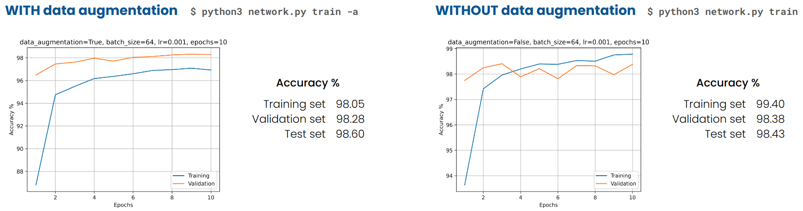

# Recognition of handwritten (long) numbers
> Neural Network recognizer of long handwritten numbers via the use of a webcam.

---
The aim of this project is to build a CNN model trained on MNIST dataset and to exploit its classification capabilities to recognize a sequence of several single handwritten digits (that can be considered as a long number) given as an input image that the user can take from her/his webcam.

> **STRONG ASSUMPTION**: the input image must have homogeneous white background, and the digits must be written in dark color.

---
**Table of contents**
* [Project description](#project-description)
* [Download and setup](#download-and-setup)
* [Usage example](#usage-example)
* [Future developments](#future-developments)
* [Directory structure](#directory-structure)
* [Documentation](#documentation)
* [Info](#info)
---

## Project description

**Workflow**

  <p align="center">
  
  </p>

As the picture shows, the project may be divided into three main phases:

 * [**Phase 1**: Training of the model](#phase-1-training-of-the-model)
 * [**Phase 2**: Input image segmentation and digit extraction](#phase-2-input-image-segmentation-and-digit-extraction)
 * [**Phase 3**: Long number recognition](#phase-3-long-number-recognition)
 
In a nutshel: the CNN model is trained on the MNIST dataset (with data augmentation techniques and without them) in order to obtain a trained model. Once the trained model is ready, it can be fed with the input image (taken from the webcam) which has been preprocessed and segmented accordingly. At this point the model can classify all the single digits written on the input image and returns the whole long number.


### Phase 1: Training of the model

This phase is developed in the `network` module and has the following structure:
* **MNIST dataset decoding and handling** (_a detailed explanation is given [here][file-decode-notebook]_)
   * `network.utils.download()` function: downloads the `.IDX` file from the given URL source and stores it in the folder given as argument.
   * `network.utils.store_file_to_tensor()` function: takes the downloaded file (format `.IDX`) and store its contents into a `torch.tensor` following the provided encoding.
   * `network.dataset.MNIST()` class: takes care of:
     * downloading the dataset
     * storing it into `data` and `labels` tensors
     * splitting (`split()`) the dataset into training set and validation set according to some proportions
     * returning a `DataLoader` (`get_loader()`) of the current dataset (needed for iterating over it)
     * printing some statistics and classes distribution
     * applying some preprocessing operations (such as random rotations for data augmentation) (`set_preprocess()`)
> **NOTE**: the random rotations are of small angles since MNIST is not rotation-invariant (6 -> 9)
* **CNN model implementation**
   * `network.cnn.CNN()` class: takes care of:
     * building the CNN model (shown in the picture below)
     * defining the preprocess operations to be performed on the elements of the dataset while iterating over it
     * saving and loading the model
     * implementing the:
       * `forward()` function: implicitly build the computational-graph
       * `__decision()` function: chooses the output neuron having maximum value among all the others 
       * `__loss()` function: applies the Cross Entropy loss to the output (before softmax)
       * `__performance()` function: computes the accuracy as number of correct decisions divided by the total number of samples
     * training the model by mean of the `train_cnn()` method (Adam optimizer is the default one)
     * evaluating the model by mean of the `eval_cnn()` method
  <p align="center">
  
  </p>
* **Training (with and without data augmentation)**  
   The training procedure is done both with data augmentation and without it. In this project, when talking about data augmentation we mean random rotation between -15° and + 15° of the samples in the training set.
  * `$ python3 network/network.py -h`: to see all the possible parameters for the training procedure
  * `$ python3 network/newtork.py train -a`: to train the network with data augmentation
  * `$ python3 network/newtork.py train`: to train the network without data augmentation
  <p align="center">
  
  </p>
  


### Phase 2: Input image segmentation and digit extraction

The image segmentation and the webcam capture tasks are implemented in the `input` module.
The structure of this module is as follows:
* **Webcam capture**
  * TODO
* **Image segmentation** (_a detailed explanation is given [here][graph-based-segmentation]_)
  * `input.segmentation.GraphBasedSegmentation()` class: implements the graph-based segmentation algorithm proposed by Felzenszwalb et. al. ([paper][graph-based-segmentation-paper]):
    * `__build_graph()`: builds a graph from an input image
    * `segment()`: segments the image applying the Felzenszwalb's algorithm to the graph (it uses some tuning parameters `k` and `min_size`)
    * `generate_image(): generate the segmented image by giving random colors to the pixels of the various regions
    * `__find_boundaries()`: finds the segmented regions' boundaries
    * `draw_boxes()`: draws the boxes around the segmented regions
    * `extract_digits()`: extract a `torch.tensor` of the segmented digits (see next step)
  * `input.segmentation.DisjointSetForest()` class: the data-structure used by the algorithm (not really used outside the other class).
  <p align="center">
  
  </p>
* **Digit extraction** (_a detailed explanation is given [here][digits-extraction]_)  
  The digit extraction procedure is carried out by the `extract_digits()` method of the `GraphBasedSegmentation()` class.  
  Once the regions' boundaries are found:
  * the regions are sliced out from the original image
  * the slices are resized according to the MNIST dataset samples dimensions (28x28)
  * the resized slices are modified in order to obtain an image which as close as possible to the one that the network saw in training phase
  * the modified slices are converted into a `torch.tensor` which will be used as input to the network


### Phase 3: Long number recognition

TODO

## Download and Setup

First, be sure to have installed in your system at least the following:

* `python 3.8.5`
* `pip 20.0.2`
* `git 2.25.1`

I'm not able to guarantee that other versions will work correctly.

Then, the project directory can be downloaded using the following commands in a Linux/MacOS/Windows terminal:

```
git clone https://github.com/filippoguerranti/handwritten_long_numbers_recognition.git
cd handwritten_long_number_recognition
pip3 install -r requirements.txt`
```

The last command will install all the needed dependencies for this project.
Some issues may arise for the OpenCv library. If it happens, please see the note below for more informations.

> **NOTE**: informations about how to install OpenCV in your platform can be found [here][opencv-installation].

## Usage example

The `usage_example.ipynb` notebook shows some simple usage cases.


## Future developments

* Draw rotated boxes around numbers which are written in diagonal

   
## Directory structure

```
.
├── img
│   ├── cnn-model.png
│   ├── graph-based-segmentation.png
│   ├── input
│   │   ├── img-20201229-22648.png
│   │   ├── img-20201229-22722.png
│   │   ├── img-20201229-22753.png
│   │   ├── img-2020128-213510.png
│   │   ├── img-2020129-0574.png
│   │   ├── img-2020129-12029.png
│   │   ├── img-2020129-13428.png
│   │   ├── img-2020129-1345.png
│   │   ├── img-2020129-13744.png
│   │   ├── img-202114-215659.png
│   │   └── img-202114-215724.png
│   └── workflow.png
├── __init__.py
├── input
│   ├── digits_extraction.ipynb
│   ├── graph_based_segmentation.ipynb
│   ├── __init__.py
│   ├── README.md
│   ├── segmentation.py
│   └── webcam_capture.py
├── LICENSE
├── models
│   ├── CNN-lr0.001-epochs10-202119-201426.pth
│   └── CNN-lr0.001-epochs10-202119-202145.pth
├── network
│   ├── cnn.py
│   ├── dataset.py
│   ├── file_decoding_procedure.ipynb
│   ├── __init__.py
│   ├── network.py
│   ├── README.md
│   └── utils.py
├── README.md
├── requirements.txt
├── results
│   ├── CNN-lr0.001-epochs10-202119-201426.png
│   └── CNN-lr0.001-epochs10-202119-202145.png
└── usage_example.ipynb
```

## Documentation
* [MNIST dataset][mnist]
* [PyTorch documentation][torch]
* [Pillow documentation][pillow]
* [OpenCV documentation][opencv]
* [NumPy documentation][numpy]


## Info

Author: Filippo Guerranti <filippo.guerranti@student.unisi.it>

I am a M.Sc. student in Computer and Automation Engineering at [University of Siena][unisi], [Department of Information Engineering and Mathematical Sciences][diism]. This project is inherent the Neural Network course held by prof. [Stefano Melacci][melacci].

For any suggestion or doubts please contact me by email.

Distributed under the Apache-2.0 License. _See ``LICENSE`` for more information._

Link to this project: [https://github.com/filippoguerranti/handwritten_long_numbers_recognition][project]


<!-- Markdown link & img dfn's -->
[file-decode-notebook]: https://github.com/filippoguerranti/handwritten_long_numbers_recognition/blob/main/network/file_decoding_procedure.ipynb
[graph-based-segmentation]: https://github.com/filippoguerranti/handwritten_long_numbers_recognition/blob/main/input/graph_based_segmentation.ipynb
[graph-based-segmentation-paper]: http://people.cs.uchicago.edu/~pff/papers/seg-ijcv.pdf
[digits-extraction]: https://github.com/filippoguerranti/handwritten_long_numbers_recognition/blob/main/input/digits_extraction.ipynb
[mnist]: http://yann.lecun.com/exdb/mnist/
[numpy]: https://numpy.org/doc/stable/
[pillow]: https://pillow.readthedocs.io/en/stable/
[torch]: https://pytorch.org/docs/stable/index.html
[opencv]: https://docs.opencv.org/master/index.html
[opencv-installation]: https://docs.opencv.org/master/df/d65/tutorial_table_of_content_introduction.html
[project]: https://github.com/filippoguerranti/handwritten_long_numbers_recognition
[unisi]: https://www.unisi.it/
[diism]: https://www.diism.unisi.it/it
[melacci]: https://www3.diism.unisi.it/~melacci/
